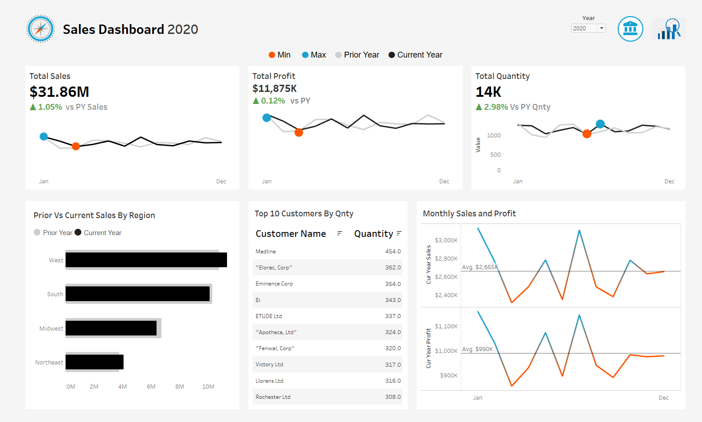

### Sales Data Analysis

#### Dashboard View

    

### HOW TO USE:

Just Open .twbx file provided for Tableau -> represents tableau packaged work book that contains all data + dashboard

There is .bak file for sql server database used for this dataset.

You can read documentation provided in pdf form to know how this was built along with calculated fields.

You can even verify dashboard with sql script
